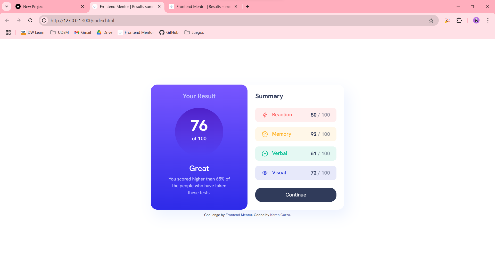
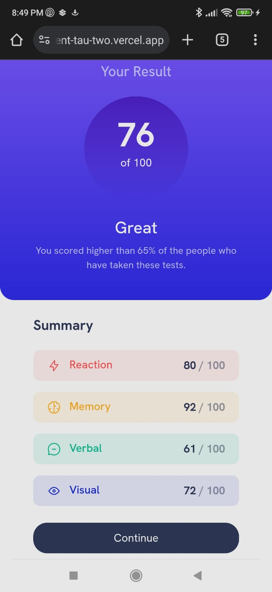

# Frontend Mentor - Results summary component solution

This is a solution to the [Results summary component challenge on Frontend Mentor](https://www.frontendmentor.io/challenges/results-summary-component-CE_K6s0maV). Frontend Mentor challenges help you improve your coding skills by building realistic projects. 

## Table of contents

- [Overview](#overview)
  - [The challenge](#the-challenge)
  - [Screenshot](#screenshot)
  - [Links](#links)
- [My process](#my-process)
  - [Built with](#built-with)
  - [What I learned](#what-i-learned)
  - [Continued development](#continued-development)
  - [Useful resources](#useful-resources)
- [Author](#author)

## Overview

### The challenge

Users should be able to:

- View the optimal layout for the interface depending on their device's screen size
- See hover and focus states for all interactive elements on the page
- **Bonus**: Use the local JSON data to dynamically populate the content

### Screenshot

#### Desktop


#### Mobile


### Links

- [Live Site URL](https://results-summary-component-tau-two.vercel.app/)

## My process

### Built with

- Semantic HTML5 markup
- Flexbox
- CSS Grid
- JavaScript
- [Bootstrap](https://getbootstrap.com/) - for styles and layout

### What I learned

#### Gradients
```css
background-image: linear-gradient(hsl(252, 100%, 67%), hsl(241, 81%, 54%));
```

#### Importing a JSON file
```js
import data from './data.json' with { type: 'json' };
```

> [!NOTE]  
> The project must be running in a server <i>(e.g. http://127.0.0.1:3000/index.html)</i>

#### Creating and appending elements to HTML with JavaScript
```js
var statistic = document.createElement("div");
statistic.classList.add("statistic", element.category.toLowerCase() + "-bg", "mb-3");

document.getElementById("summary").appendChild(statistic);
```

### Continued development

* Perfecting the use of drop-shadow.

### Useful resources

- [CSS Gradients](https://www.w3schools.com/css/css3_gradients.asp)
- [Append HTML elements with JavaScript](https://www.w3schools.com/jsref/dom_obj_all.asp)
- [Importing a JSON file](https://www.koladechris.com/blog/how-to-import-a-json-file-in-javaScript/)

## Author

- Frontend Mentor - [@KarenNR](https://www.frontendmentor.io/profile/KarenNR)